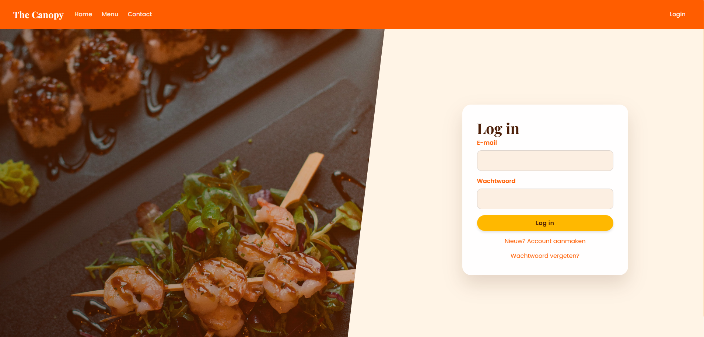
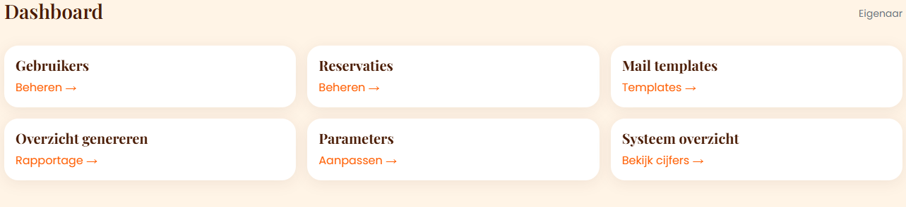
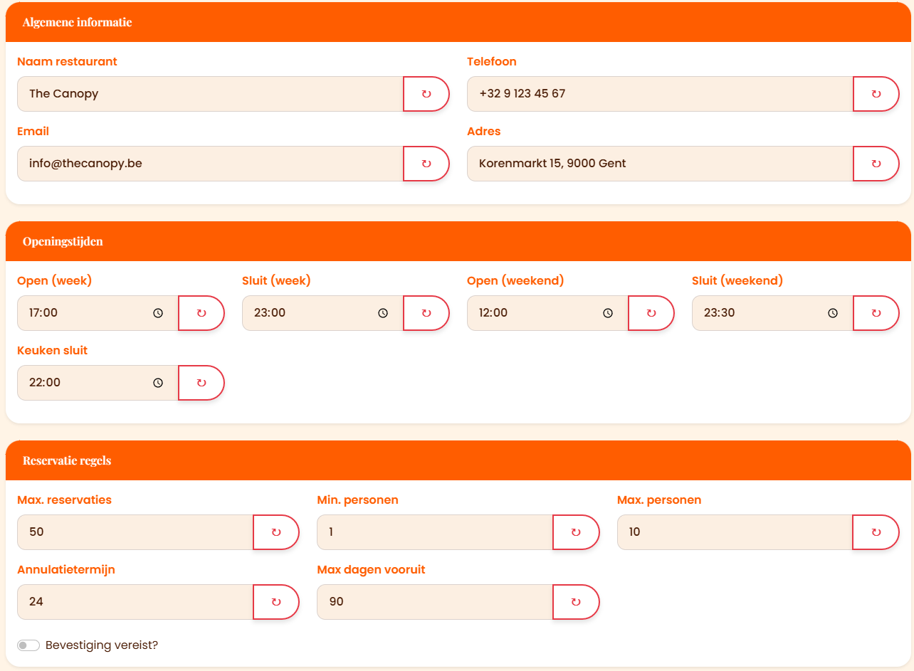
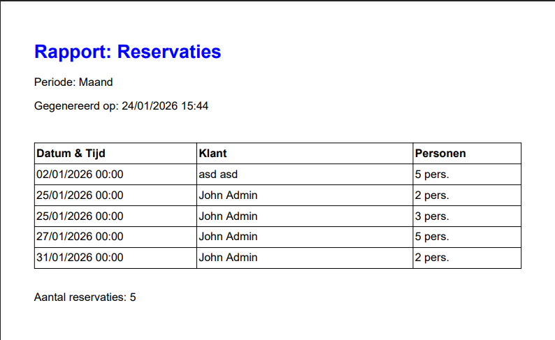

# 🍽️ Restaurant Management System


A comprehensive, full-stack web application designed to digitize restaurant operations. From table reservations and tablet-based ordering to kitchen management and financial reporting.

Built as a capstone project for the **.NET Development** track at Thomas More University of Applied Sciences.

---

## 🚀 Key Features

### 👤 Customer Portal
* **Reservations:** Real-time table booking with time-slot validation.
* **Tablet Ordering:** Guests can order food/drinks directly from their table via a digital menu.
* **Order Tracking:** Live status updates (Queued -> Preparing -> Served).
* **Reviews:** Post-dining feedback system linked to specific visits.

### 🏢 Admin & Staff Dashboard
* **Kitchen Display System:** Real-time view for chefs to manage incoming food orders.
* **Bar Interface:** Dedicated view for bartenders to process drink orders.
* **Table Management:** Visual indicators for table status (Free, Reserved, Occupied).
* **Management Reporting:** Insights into revenue, peak hours, and customer satisfaction.

---

## 👨‍💻 My Contribution (Backend & Security)

While this was a team effort, I was personally responsible for the **Security Architecture** and the **Data Reporting Engine**.

### 🔐 Identity & Access Management (IAM)
I implemented the core security layer using **ASP.NET Core Identity**:
* **Authentication:** Secure Login/Register flows with hashed passwords.
* **Role-Based Access Control (RBAC):** Distinct permissions for Customers, Waiters, Chefs, and Owners.
* **Account Recovery:** Secure "Forgot Password" flow via email tokens.
* **User Management:** Admin interface to manage staff accounts and roles.

### 📊 Data Reporting & Configuration
I built the logic to turn raw database entries into actionable business intelligence:
* **Reporting Engine:** Aggregating data from reservations and orders to generate revenue reports (Daily/Weekly/Monthly).
* **PDF Export:** Functionality to download management reports as PDF files.
* **System Parameters:** Created a dynamic configuration system to manage restaurant settings (e.g., opening hours, tax rates) without code changes.

---

## 🛠️ Tech Stack

* **Framework:** .NET 6 / ASP.NET Core MVC
* **Language:** C#
* **Database:** Microsoft SQL Server
* **ORM:** Entity Framework Core (Code-First approach)
* **Frontend:** Razor Pages, HTML5, CSS3, Bootstrap
* **Tools:** Git, Visual Studio, SQL Server Management Studio (SSMS)

---

## 📸 Screenshots

### 🔐 Security & Access
**Login Page** - *Secure authentication using ASP.NET Core Identity*


---

### 🚀 Management Dashboard
**Main Dashboard** - *Overview of active tables and daily operations*


**System Statistics** - *Real-time metrics on orders and reservations*


---

### ⚙️ Configuration
**System Parameters** - *Dynamic configuration of restaurant settings (CRUD)*


---

### 📊 Reporting Engine
**Reporting Dashboard** - *Visual insights into revenue and occupation*


**PDF Export** - *Generated management report (PDF) based on SQL data*


---

## ⚙️ How to Run Locally

1.  **Clone the repository**
    ```bash
    git clone [https://github.com/islam-sadaev/restaurant-management-dotnet.git](https://github.com/islam-sadaev/restaurant-management-dotnet.git)
    ```
2.  **Configure Database**
    Update the connection string in `appsettings.json` to point to your local SQL Server instance.
3.  **Apply Migrations**
    Open the Package Manager Console (or terminal) and run:
    ```bash
    dotnet ef database update
    ```
4.  **Run the Application**
    ```bash
    dotnet run
    ```